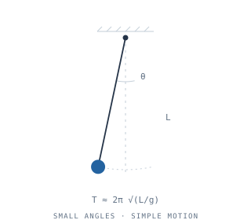
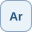
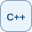

[preview.html](https://github.com/user-attachments/files/33248565/preview.html)
<!doctype html><html lang="en"><meta charset="utf-8"><meta name="viewport" content="width=device-width, initial-scale=1"><title>Guilherme Bassani — profile preview</title><body><nav>PROFILE README · LOCAL PREVIEW<button onclick="toggle()">Toggle theme</button></nav><article><!-- Replace YOUR_USERNAME, repository slugs, and example.com links before publishing. -->
<table>
<tr>
<td width="65%" valign="middle">

<h1>Guilherme Bassani</h1>

<strong>Curiosity, translated into things that work.</strong>

I'm a Systems Development student drawn to the place where code meets the physical world. I enjoy building with hardware and software, testing ideas through experiments, and working backwards from “it works” to “why does it work?” Engineering, physics, and mathematics shape the questions I ask; programming helps me explore them.

</td>
<td width="35%" align="center" valign="middle">
<picture>
  <source media="(prefers-color-scheme: dark)" srcset="assets/pendulum-dark.svg">
  <source media="(prefers-color-scheme: light)" srcset="assets/pendulum.svg">
  
</picture>
</td>
</tr>
</table>

<h3>What keeps me curious</h3>
<ul>
<li><strong>Computer engineering:</strong> connecting software, electronics, and the systems they form.</li>
<li><strong>Software development:</strong> turning ideas into useful tools and understanding the choices behind them.</li>
<li><strong>Physics &amp; mathematics:</strong> moving between a model, a measurement, and an explanation.</li>
<li><strong>Machine learning &amp; AI:</strong> learning how models work and where they can be useful.</li>
<li><strong>Scientific research:</strong> learning to ask better questions, test assumptions, and document what I find.</li>
</ul>
<h3>Tools &amp; ongoing learning</h3>

Tools I use in projects and coursework. This is a working toolkit, not a claim of mastery.

<table>
<thead>
<tr>
<th align="left"></th>
<th align="left">Technologies</th>
</tr>
</thead>
<tbody><tr>
<td align="left"><strong>Languages</strong></td>
<td align="left"> Python &nbsp;  Java &nbsp;  TypeScript &nbsp;  JavaScript</td>
</tr>
<tr>
<td align="left"><strong>Frameworks</strong></td>
<td align="left"> React &nbsp;  Next.js &nbsp;  Spring Boot &nbsp;  FastAPI</td>
</tr>
<tr>
<td align="left"><strong>Development</strong></td>
<td align="left"> Git &nbsp;  GitHub</td>
</tr>
<tr>
<td align="left"><strong>Hardware</strong></td>
<td align="left"> Arduino &nbsp;  ESP32</td>
</tr>
</tbody></table>

<strong>Exploring &amp; strengthening</strong>

 C++ &nbsp;  Docker &nbsp;  Linux

I&#39;m also exploring machine learning, embedded intelligence, and the methods behind scientific research.

<h3>Project notebook</h3>
<!-- These are project slots, not claims of completed work. Replace titles, descriptions, and URLs with real repositories. -->
<table>
<thead>
<tr>
<th align="left">Focus</th>
<th align="left">Repository</th>
<th align="left">What belongs here</th>
</tr>
</thead>
<tbody><tr>
<td align="left">Software</td>
<td align="left"><a href="https://github.com/YOUR_USERNAME/YOUR_SOFTWARE_REPO">Software project</a></td>
<td align="left">An application, the problem it addresses, and the decisions behind it.</td>
</tr>
<tr>
<td align="left">Embedded systems</td>
<td align="left"><a href="https://github.com/YOUR_USERNAME/YOUR_EMBEDDED_REPO">Hardware + code</a></td>
<td align="left">Electronics, firmware, and the link between physical inputs and software.</td>
</tr>
<tr>
<td align="left">Experimental physics</td>
<td align="left"><a href="https://github.com/YOUR_USERNAME/YOUR_EXPERIMENT_REPO">Scientific experiment</a></td>
<td align="left">A question, an experimental setup, measurements, and what they reveal.</td>
</tr>
</tbody></table>
<h3>Find me elsewhere</h3>

<a href="https://www.linkedin.com/in/YOUR_LINKEDIN/"> LinkedIn</a> &nbsp;&nbsp; <a href="https://www.instagram.com/YOUR_INSTAGRAM/"> Instagram</a> &nbsp;&nbsp; <a href="https://example.com"> Portfolio</a> &nbsp;&nbsp; <a href="https://example.com/resume.pdf"> Resume</a>

</article></body></html>
